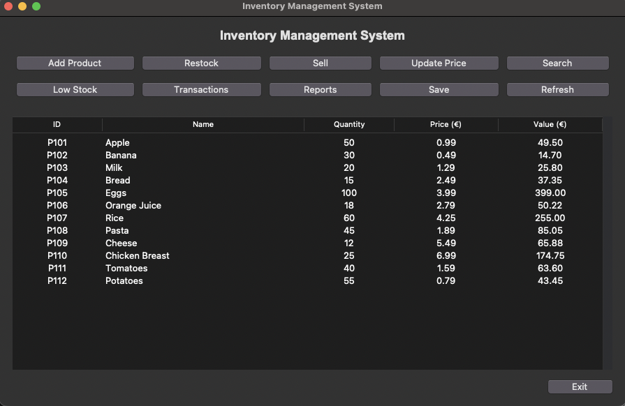
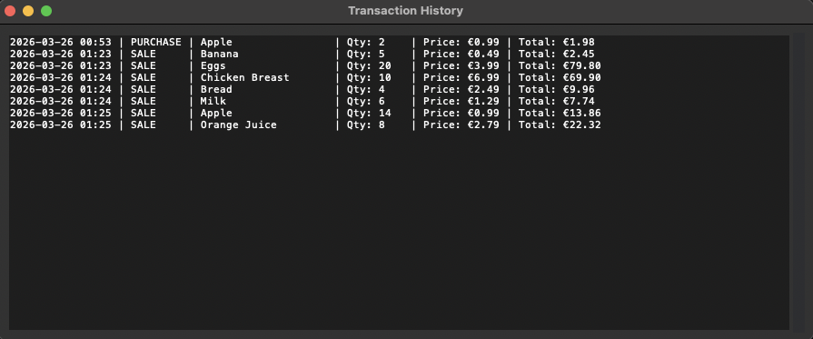
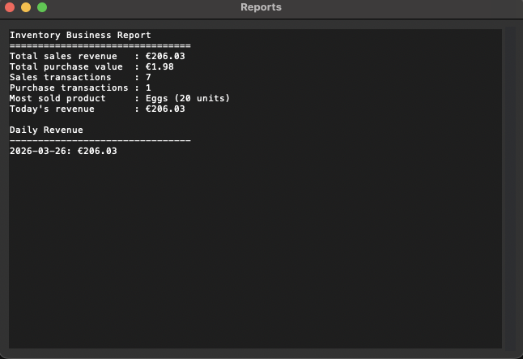

# 🛒 Inventory Management System

A Python-based inventory management application that demonstrates object-oriented programming, file handling, data analysis, and graphical user interface development.

This project evolved step-by-step from a simple command-line tool into a full-featured application with reporting and a Tkinter GUI.

---

## Screenshots

### Main Interface



### Transactions View



### Reports Dashboard



---

## Demo Overview

This application simulates a real-world inventory management workflow:

* Users can add and manage products through a graphical interface
* Stock levels are updated automatically when items are sold or restocked
* Every transaction is recorded and stored for analysis
* The system generates business reports such as total revenue, most sold product, and daily sales

The project demonstrates how core programming concepts can be applied to build a practical, user-friendly application.

---

## Features

### Core Functionality

* Add new products
* Update stock quantity
* Restock products
* Sell products
* Update product prices
* Search products by name
* Display inventory in a structured format
* Low-stock alerts

### Data Management

* Inventory stored using CSV files
* Transactions stored using JSON
* Persistent data across sessions

### Transaction System

* Records every sale and restock
* Stores date, type, quantity, and total value
* View complete transaction history

### Reports & Analytics

* Total sales revenue
* Total purchase value
* Number of sales and purchase transactions
* Most sold product
* Daily revenue tracking

### Graphical User Interface (GUI)

* Built with Tkinter
* Interactive buttons and forms
* Inventory displayed in a table
* Separate views for transactions and reports

---

## Project Structure

```
inventory-management-system/
├── main.py              # Launches GUI
├── main_cli.py          # (Optional) CLI version
├── gui.py               # Tkinter interface
├── product.py           # Product class
├── inventory.py         # Inventory logic
├── transactions.py      # Transaction management
├── reports.py           # Business analytics
├── inventory_data.csv   # Inventory data
├── transactions.json    # Transaction history
├── README.md
└── .gitignore
```

---

## Technologies Used

* Python
* Object-Oriented Programming (OOP)
* CSV file handling
* JSON data storage
* Tkinter (GUI development)

---

## How to Run

### Run GUI version (recommended)

```
python main.py
```

or (Mac/Linux):

```
python3 main.py
```

### Run CLI version (optional)

```
python main_cli.py
```

---

## Project Evolution

* **Version 1**

  * Basic command-line inventory system
  * Used text file storage

* **Version 2**

  * Refactored into object-oriented design
  * Introduced Product and Inventory classes

* **Version 3**

  * Switched data storage from text file to CSV

* **Version 4**

  * Added transaction tracking using JSON

* **Version 5**

  * Implemented business reports and analytics
  * Built a Tkinter graphical user interface

---

## Future Improvements

* Export reports to CSV or Excel
* Add user authentication system
* Improve GUI styling and layout
* Deploy as a desktop application

---

## Author

Tanvir Ahmed
